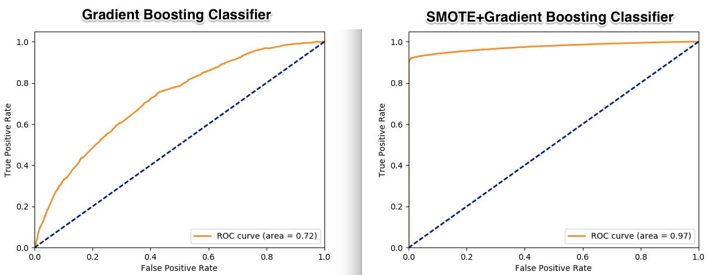

Telco customer crunch
===================
The goal of this script is to train a classifier using the dataset of Telco customer crunch based on Scikit-Learn.
Implements in Python the ML Azure approach https://gallery.cortanaintelligence.com/Experiment/Telco-Customer-Churn-5 

The raw dataset is imbalanced. Hence, the SMOTE algorithm is used to balance the datasets. SMOTE is included in the library http://contrib.scikit-learn.org/imbalanced-learn
The model used is the Gradient Boosting Classifier (https://en.wikipedia.org/wiki/Gradient_boosting).

The next figure shows the performance gain appliying SMOTE in the preprocessing stage:

